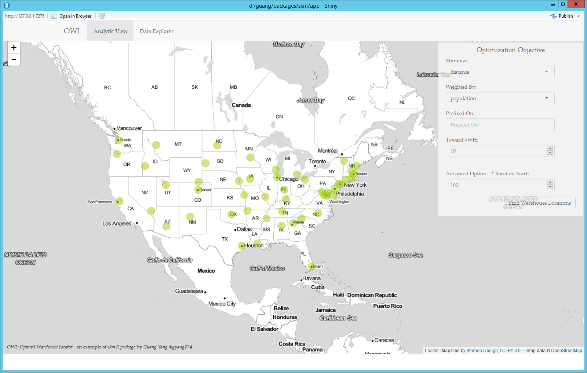
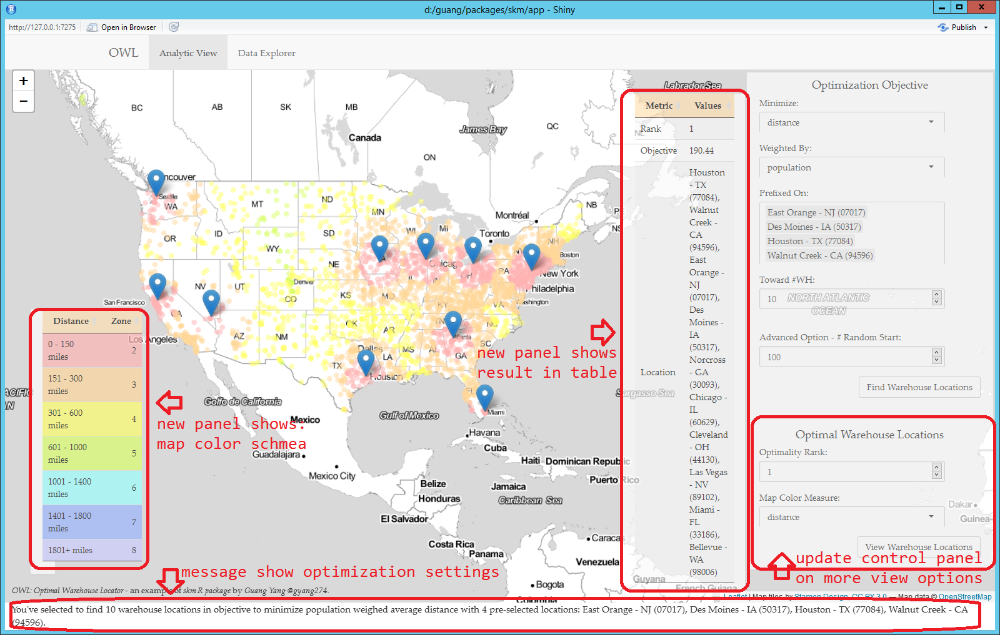
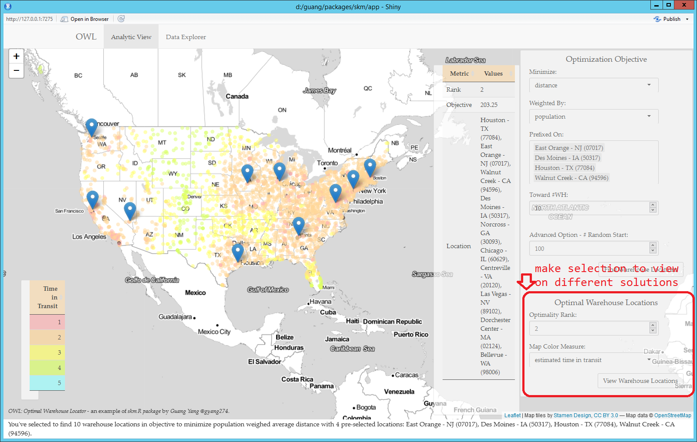

---
output:
  md_document:
    variant: markdown_github
---

<!-- README.md is generated from README.Rmd. Please edit that file -->

```{r, echo = FALSE}
knitr::opts_chunk$set(
  collapse = TRUE,
  comment = "#>",
  fig.path = "README-"
)
```

# OWL - Optimal Warehouse Locator

## OWL (Optimal Warehouse Locator) finder is a shiny application based on R package [skm](https://github.com/gyang274/skm).

Welcome to view this [OWL app on shinyapp.io](https://gyang.shinyapps.io/owl/). 

## skm (selective k-means) 

skm (selective k-means) solves the following problem: assume a set of source $s$, a set of target $t$, and the costs $d(s, t)$ of shipping from $s$ to $t$, select $k$ of $s$ that minimizes the overall costs of shipping from $k$ such $s$ to all $t$, e.g., min(sum(min(d(s, t) for each t w.r.t selected k s))).

## OWL Shiny Page: 

- Analytic View:

    + The page is initialized with a U.S. map and a control panel at right hand side:
  
        {#owl_init .class width=640px height=407px}.
  
    + The page is supported by [U.S. zip 2012 data](http://federalgovernmentzipcodes.us/), with a full coverage of all 5 digits zip codes with their population and total incomes estimated from tax file. The analysis assumes user want to build warehouses from the 51 locations one in each states and ship the product to all states. These 51 locations are the 5 digits zip code in the center of 3 digits zip code that has highest population in each state, and are markered as green circle on the map. User can click on the green circle, information will be popup and suggestions will be shown in the message box on the bottom.
  
        {#owl_init_click .class width=640px height=407px}.

    + On the control panel, _Optimization Objective_, give options on:
    
        1. Choose the objective: minimize distance, zone - [Fedex Rates on Zone](http://www.thesnowtrade.org/images/support/FedEx%20Zones.pdf), or estimated time in transit.
    
        2. Choose the weighing strategy: weighted each zip area by population or total income?
    
        3. Choose the location where a warehouse is already built, e.g., prefixed on, so that the solution will be as on top of these warehouses built.
    
        4. Choose the number of warehouse want to build. The analysis can be view as: finding \<number\> warehouse location with respect to minize \<weighting\> weighted average \<objective\>, assume \<pre-built\>.
        
            {#owl_option .class width=640px height=407px}.
  
        5. Click _Find Warehouse Locations_ to run analysis and update the map, control panel and page.
    
        {#owl_find .class width=640px height=407px}.  
    
    + After click _Find Warehouse Locations_, control panel will be updated with a new section _Optimal Warehouse Locations_, which give options on:
  
        1. Choose to view results with optimality rank 1, 2, ..., up to the number of random start. This enable the user to view not only the best solution, but also the 2nd best solution, 3rd best solution, and so on. Because, in practial, we often make decsion not only based on mathematical optimality but also other factors.
    
        2. Choose to color the map with repsect to a measure like distance, zone, estimated time in transit, default is the same as the objective, but can be different.
    
    + After click _Find Warehouse Locations_, map will be updated with markers on selected locations in solution, and color each 5 digits zip codes with respect to the measure selected in _Optimal Warehouse Locations_ panel. The map would color a sample of all 5 digits zip codes, basically, 10 of 5 digits zip codes are random selected from each 3 digits zip codes level and shown on map.
  
    + After click _Find Warehouse Locations_, page will be updated with a new panel on left bottom corner shown the color schema, and a new panel on right bottom corner shown the solution in table.
  
        {#owl_view .class width=640px height=407px}.
  
    + Analysis is running in real-time, often takes 8-10 seconds for 100 random starts.

- Data Explorer: 

    + View zip2012 data in table.


## TODO:

- Add customerized icons on map-view based on prefixed or not, see icons being commented out.

## NOTE:

- Shiny App is fully developed yet not shared, if interested, please contact [the author](mailto:gyang274@gmail.com).

